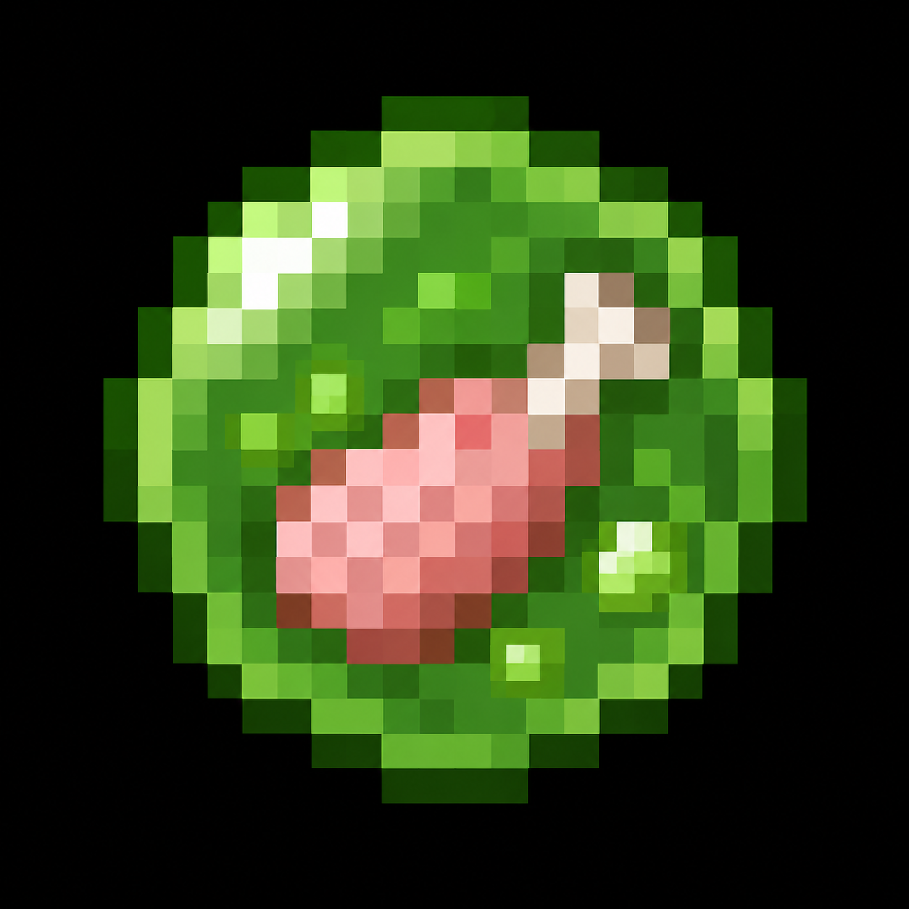
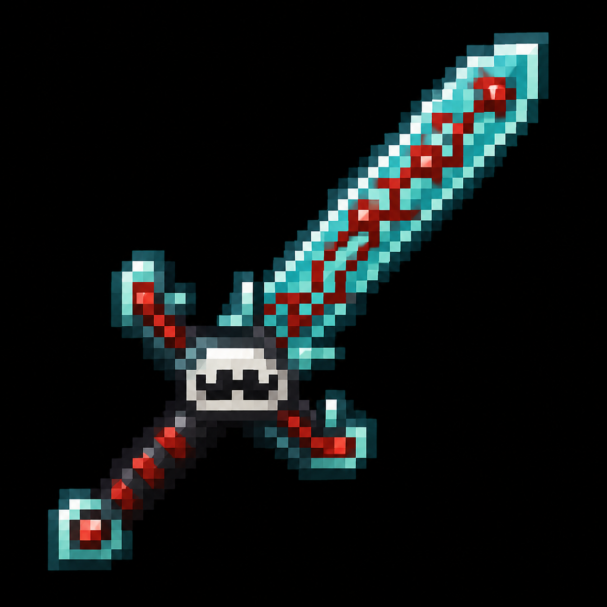
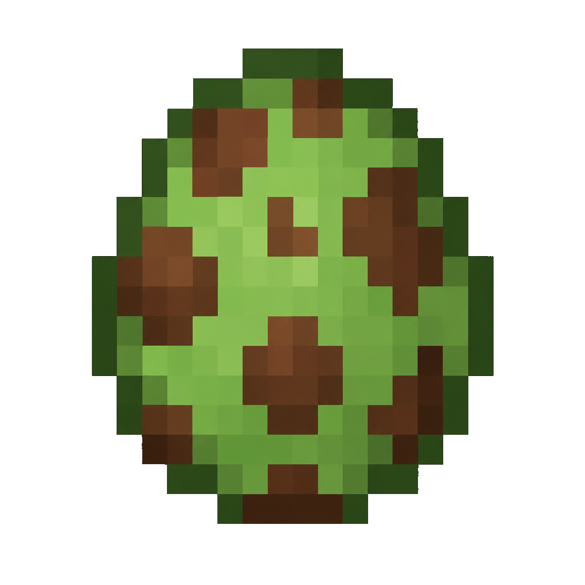
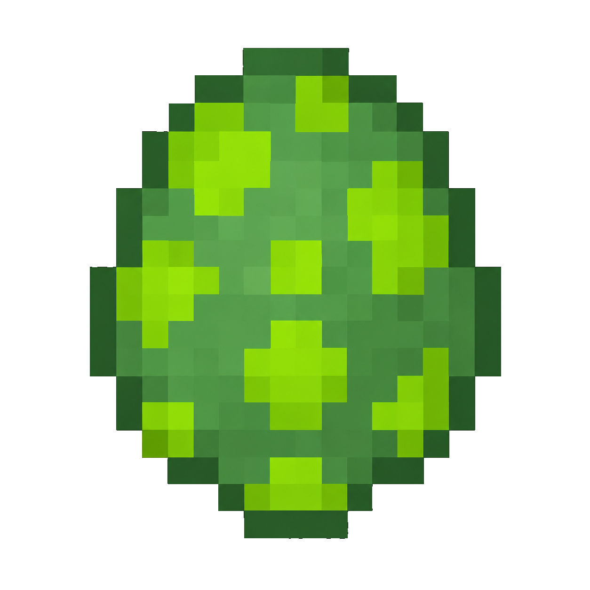

# 🐸 Frog & Slime Gamemode 🫧

**A unique Minecraft Fabric mod where frog and slime helpers beat the game for you!**

[Features](#features) • [Installation](#installation) • [How to Play](#how-to-play) • [Gallery](#gallery) • [Commands](#commands)

---

## What is this?

A custom gamemode where you tame frog and slime helpers that fight mobs and evolve as they kill. Inspired by content creators like Craftee, xxNestorio, DonnieBobes, Skeppy and more, but with an unexpected twist ending like in Groxs videos.

## Features

### 🎮 Core Gameplay
- **Custom Gamemode System**: Activate with `/frogslime enable` or in the game menu
- **Helper Mobs**: Tame frog and slime helpers that fight for you
- **Evolution System**: Helpers evolve through 5 stages by defeating mobs
  - Basic → Advanced → Elite → Master → *FINAL FORM*
- **Automatic Collection**: Helpers collect drops from killed mobs
- **Persistent Saving**: Gamemode state and abilities persist across server restarts
- **Player Kill Rewards**: Kill other players to gain special abilities (WayaCreate, Derpy Derp, stolen abilities)

### ✨ Visual Effects
- **Custom Particles**: Helpers spawn particles when evolving, being pet, and during idle
- **Dynamic Name Tags**: Helpers display their evolution stage with color-coded names
- **Animated Entities**: Smooth animations and visual effects
- **Custom Titles**: Dramatic on-screen titles during key moments
- **Progress Bar HUD**: Visual progress bar showing gamemode completion percentage
- **Achievement Toasts**: Custom popup notifications for achievements with sound effects

### 🎯 Challenges & Progression
- **Task & Challenge System**: Complete 10 insane challenges with rewards
- **Custom GUI**: Open tasks menu with Task Book or `/frogslime tasks`
- **Achievement System**: Unlock 7 custom advancements
- **Player Transformations**: Eat frog/slime food to gain their abilities

### 👹 Boss Fight
- **Giant Slime Boss**: The Ender Dragon has been replaced... with a GIANT SLIME?!
- **Unexpected Ending**: Defeat the boss to trigger the final evolution... but something goes wrong

### 🌌 Custom Dimension
- **Transformed End**: A custom dimension variant of the End using datapack configuration
- **Teleportation Commands**: Easy access to dimension via `/frogslime dimension transformed_end`
- **Configurable**: JSON-based dimension settings for easy customization
- **Fallback System**: Automatically falls back to regular End if custom dimension unavailable

### � Custom Items
- **Evolution Stones**: Instantly evolve your helpers (craftable and upgradeable)
- **Special Foods**: Feed your helpers to strengthen them
- **YouTuber Swords**: Dream, Technoblade, Grian, and Mumbo Jumbo themed weapons
- **Funny Armor**: Mustard Helmet, Orphan Shield, Prankster Chestplate
- **Task Book**: View and track your challenges
- **Final Evolution Crystal**: Unlock the ultimate slime form
- **Custom Potions**: Frog Power, Slime Resilience, WayaCreate Blessing, Derpy Curse, Manhunt Tracker
- **Manhunt Compass**: Tracks assigned manhunt targets

## 🎮 Interactive GUI

**[📖 Open Interactive Minecraft GUI](docs/interactive-gui.html)**

Experience the mod's items, crafting, and collections with an authentic Minecraft-style interface!

**Features:**
- **📦 Collections**: Browse all items with category filters
- **⚒️ Crafting**: Interactive crafting table with recipe selector
- **🧪 Potions**: Brewing stand interface
- **🏆 Achievements**: Track your progress
- **⭐ Skills**: Evolution skill tree

**Hover over items** to see their NBT tags, stats, and abilities - just like in-game!

## 📚 Item Collections

### Evolution Items
| Item | Texture | Stats | Abilities | NBT Data |
|------|---------|-------|-----------|----------|
| **Evolution Stone** |  | Max Stack: 16 | Instantly evolves helpers to next stage | `{EvolutionPower: 1}` |
| **Final Evolution Crystal** |  | Max Stack: 1 | Unlocks ultimate slime form after boss | `{FinalForm: true, BossDefeated: true}` |

### Food Items
| Item | Texture | Hunger | Saturation | Effects |
|------|---------|--------|------------|---------|
| **Slime Food** |  | 4 | 0.6 | Jump Boost II (30s), Resistance I (30s) |
| **Frog Food** |  | 3 | 0.5 | Speed I (30s), Water Breathing (30s) |

### YouTuber Swords
| Item | Texture | Material | Attack Damage | Attack Speed | Special Ability |
|------|---------|----------|---------------|--------------|-----------------|
| **Dream's Blade** |  | Netherite | +3 | -2.4 | Speed III (10s) on use |
| **Technoblade's Blade** |  | Netherite | +5 | -2.2 | Strength II (10s), Resistance II (10s) |
| **Grian's Blade** |  | Diamond | +3 | -2.4 | Invisibility (5s) on use |
| **Mumbo Jumbo's Blade** |  | Diamond | +3 | -2.4 | Haste III (10s) on use |

### Funny Armor
| Item | Texture | Material | Protection | Special |
|------|---------|----------|------------|---------|
| **Mustard Helmet** |  | Gold | 2 | Has enchantment glint |
| **Orphan Shield** |  | Iron | - | Custom NBT: `{OrphanShield: true}` |
| **Prankster Chestplate** |  | Leather | 3 | Purple variant |

### Utility Items
| Item | Texture | Max Stack | Function |
|------|---------|-----------|----------|
| **Task Book** |  | 1 | Shows gamemode progress and objectives |
| **Manhunt Compass** |  | 1 | Tracks nearest player |
| **Ability Drop** |  | 64 | Dropped by mobs, grants abilities |

### Role Items
| Item | Texture | Function |
|------|---------|----------|
| **Miner Role** |  | Assigns mining AI to helper |
| **Builder Role** |  | Assigns building AI to helper |
| **Farmer Role** |  | Assigns farming AI to helper |
| **Lumberjack Role** |  | Assigns woodcutting AI to helper |
| **Combat Role** |  | Assigns combat AI to helper |

### Spawn Eggs
| Item | Texture | Entity |
|------|---------|--------|
| **Frog Helper Spawn Egg** |  | Frog Helper |
| **Slime Helper Spawn Egg** |  | Slime Helper |

## 🏆 Achievements

| Achievement | Icon | Description | Requirements |
|-------------|------|-------------|---------------|
| **First Helper** | 🐸 | Tame your first frog or slime | Tame any helper |
| **Evolution Beginner** | ⭐ | Evolve a helper to stage 1 | Helper kills 10 mobs |
| **Evolution Expert** | ⭐⭐ | Evolve a helper to stage 2 | Helper kills 25 mobs |
| **Evolution Master** | ⭐⭐⭐ | Evolve a helper to stage 3 | Helper kills 50 mobs |
| **Final Form** | 👑 | Unlock the final slime evolution | Defeat boss + use crystal |
| **Boss Slayer** | 👹 | Defeat the Giant Slime Boss | Reach The End and win |
| **Task Master** | 📋 | Complete all 10 challenges | Finish all tasks |

## ⭐ Evolution Skill Tree

| Skill | Icon | Status | Requirements | Effect |
|-------|------|--------|--------------|--------|
| **Basic Attack** | ⚔️ | ✅ Unlocked | None | Helper attacks nearby mobs |
| **Mob Collection** | 📦 | ✅ Unlocked | Basic Attack | Helper auto-collects drops |
| **Evolution Stage 1** | ⭐ | ✅ Unlocked | Kill 10 mobs | +10 Health, +2 Damage |
| **Evolution Stage 2** | ⭐⭐ | 🔒 Locked | Kill 25 mobs | +20 Health, +4 Damage |
| **Evolution Stage 3** | ⭐⭐⭐ | 🔒 Locked | Kill 50 mobs | +30 Health, +6 Damage |
| **Final Evolution** | 👑 | 🔒 Locked | Defeat Giant Slime Boss | 200 Health, 30 Damage, 100% KB Resistance |

### Quick Recipe Reference
<table>
  <tr>
    <td align="center"> <b>Frog Helper</b></td>
    <td align="center"> <b>Slime Helper</b></td>
    <td align="center"> <b>Giant Slime Boss</b></td>
  </tr>
  <tr>
    <td align="center"> <b>Final Form Slime</b></td>
    <td align="center"> <b>Frog King</b></td>
    <td align="center"></td>
  </tr>
</table>

### Items
<table>
  <tr>
    <td align="center"> <b>Evolution Stone</b></td>
    <td align="center"> <b>Final Evolution Crystal</b></td>
    <td align="center"> <b>Task Book</b></td>
  </tr>
  <tr>
    <td align="center"> <b>Dream Sword</b></td>
    <td align="center"> <b>Technoblade Sword</b></td>
    <td align="center"> <b>Grian Sword</b></td>
  </tr>
</table>

## Installation

### Requirements
- Minecraft 1.20.1
- Fabric Loader
- Fabric API

### Steps
1. Install [Fabric Loader](https://fabricmc.net/)
2. Download the latest [Fabric API](https://www.curseforge.com/minecraft/mc-mods/fabric-api)
3. Download the latest release of Frog & Slime Gamemode
4. Place both `.jar` files in your `mods` folder
5. Launch the game!

## How to Play

1. **Start the gamemode**: `/frogslime enable` or open the game menu
2. **Spawn helpers** using spawn eggs (craftable with vanilla materials)
3. **Right-click** to tame frogs and slimes in the wild
4. **Let them fight** mobs and evolve automatically (40% drop chance for abilities)
5. **Use Evolution Stones** to speed up evolution (craftable and upgradeable)
6. **Assign roles** to helpers with `/helper <role>` for specialized AI
7. **Open Task Book** with right-click to see challenges
8. **Complete tasks** to unlock rewards
9. **Brew custom potions** for special effects
10. **Kill other players** for special abilities (PvP mode)
11. **Journey to The End** to face the GIANT SLIME BOSS
12. **Beat the boss** for the shocking finale... or will you?

### Evolution System

**Frog Helper Evolution:**
- Stage 0 → Stage 1: Kill 10 mobs
- Stage 1 → Stage 2: Kill 25 mobs
- Stage 2 → Stage 3: Kill 50 mobs

**Slime Helper Evolution:**
- Stage 0 → Stage 1: Kill 15 mobs
- Stage 1 → Stage 2: Kill 35 mobs
- Stage 2 → Stage 3: Kill 60 mobs

Each evolution increases:
- Health (+10 for frogs, +15 for slimes per stage)
- Attack Damage (+2 for frogs, +3 for slimes per stage)
- New visual effects at higher stages

### Helper Roles
Assign roles to your helpers with `/helper <role>`:
- **Miner**: Automatically mines nearby ores
- **Lumberjack**: Automatically chops nearby trees
- **Combat**: Enhanced attack damage
- **Builder**: Places blocks to build structures
- **Farmer**: Harvests and bone meals crops

### Custom Potions
Brew special potions in the brewing stand:
- **Frog Power Potion**: Jump Boost II + Speed I (brew with slime ball)
- **Slime Resilience Potion**: Resistance I + Regeneration I (brew with golden carrot)
- **WayaCreate Blessing Potion**: Strength II + Speed II + Regeneration I (brew with golden apple)
- **Derpy Curse Potion**: Slowness I + Weakness (brew with fermented spider eye)
- **Manhunt Tracker Potion**: Night Vision + Speed I (brew with glowstone)

### Manhunt Mode
Play speedrun manhunt with friends:
1. `/frogslime manhunt speedrunner` - Set the target player
2. `/frogslime manhunt hunter` - Become a hunter
3. Use Manhunt Compass to track the speedrunner
4. Compass shows distance and direction to target

### Transformed End Dimension
Access the custom dimension:
1. `/frogslime dimension transformed_end` - Teleport to the dimension
2. `/frogslime dimension return` - Return to Overworld spawn
- Uses datapack-based configuration for easy customization
- Configured with End biome and generation settings
- Can be modified in `data/frogslimegamemode/dimension/` JSON files

### Final Evolution (Slime Only)
After defeating the Giant Slime Boss, use the **Final Evolution Crystal** on your slime helper to unlock its ultimate form:
- 200 Health
- 30 Attack Damage
- 100% Knockback Resistance

## Commands

| Command | Description |
|---------|-------------|
| `/frogslime enable` | Begin the gamemode |
| `/frogslime disable` | Stop the gamemode |
| `/frogslime info` | Show help information |
| `/frogslime tasks` | Open tasks & challenges menu |
| `/frogslime reset` | Reset all gamemode data (use with caution) |
| `/frogslime manhunt speedrunner` | Set yourself as the speedrunner |
| `/frogslime manhunt hunter` | Set yourself as a hunter (targets nearest player) |
| `/frogslime manhunt end` | End the manhunt game |
| `/frogslime dimension transformed_end` | Teleport to the Transformed End dimension |
| `/frogslime dimension return` | Return from the dimension to spawn |
| `/helper <role>` | Assign a role to your helper (Miner, Lumberjack, Combat, Builder, Farmer) |

## Tasks & Challenges

| Challenge | Description |
|-----------|-------------|
| 🟤 Eat 64 Dirt Blocks | "Why? Because we can!" |
| 🐸 Jump 100 Times Near Frogs | "They love it when you dance!" |
| 🫧 Have 5 Slime Helpers | "It's a slime party!" |
| ⭐ Evolve to Master | "Peak performance achieved!" |
| 💀 Helpers Eat 100 Mobs | "Nom nom nom..." |
| 💀 Die 100 Times | "Pain is temporary, glory is forever" |
| 🍎 Eat Golden Apple Transformed | "Maximum power!" |
| 💎 Craft 100 Evolution Stones | "Stonks!" |
| 🚪 Reach The End | "The final challenge awaits..." |
| 👹 Defeat Giant Slime Boss | "Wait... where's the dragon?" |

## The Twist

When you defeat the Giant Slime Boss (yeah, we replaced the Ender Dragon with a GIANT SLIME) with your slime helper nearby, it will absorb the boss's power and unlock its FINAL FORM. Dramatic particles explode everywhere, custom titles appear on screen, and your slime becomes an unstoppable force of nature.

But be warned... your slime may become too powerful. What have you created?

**TO BE CONTINUED...**

## Why This Exists

This mod feels like it was made by a modded YouTuber with too much free time (and it kind of was). Inspired by the chaotic energy of Craftee, xxNestorio, DonnieBobes, Skeppy, and the unexpected plot twists of Groxs videos.

## Recent Updates

### v1.5.0 - Dimension Implementation
- ✅ Implemented datapack-based custom dimension system
- ✅ Configured dimension JSON files for proper generation
- ✅ Updated teleporter with RegistryKey-based dimension access
- ✅ Added fallback system to regular End if custom dimension unavailable
- ✅ Made dimension fully customizable via JSON configuration

### v1.4.0 - UI & Polish Update
- ✅ Added progress bar HUD showing gamemode completion
- ✅ Implemented custom achievement toast notifications
- ✅ Added achievement sound effects (level-up sound)
- ✅ Improved task tracking with visual progress indicators
- ✅ Enhanced HUD rendering system

### v1.3.0 - Dimension Update
- ✅ Added custom dimension system foundation
- ✅ Implemented dimension teleportation commands
- ✅ Created Transformed End dimension configuration
- ✅ Added return command for dimension travel

### v1.2.0 - Final Polish
- ✅ Added Builder and Farmer AI roles
- ✅ Integrated ManhuntCompass with ManhuntManager
- ✅ Changed potion recipes from crafting to brewing
- ✅ Added helper egg upgrade system
- ✅ Implemented persistent saving system
- ✅ Added player kill reward system
- ✅ Adjusted drop chances for balanced progression (40% for players, 50% for helpers)
- ✅ Fixed compilation errors and cleaned up code

## Contributing

Contributions are welcome! Feel free to submit issues, feature requests, or pull requests.

## License

This project is licensed under the MIT License - see the [LICENSE](LICENSE) file for details.

---

Created by **WayaCreate** (Waya Steurbaut)

[YouTube](https://youtube.com/@wayacreate) • [GitHub](https://github.com/wayacreate)

