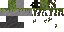
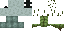
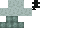
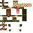
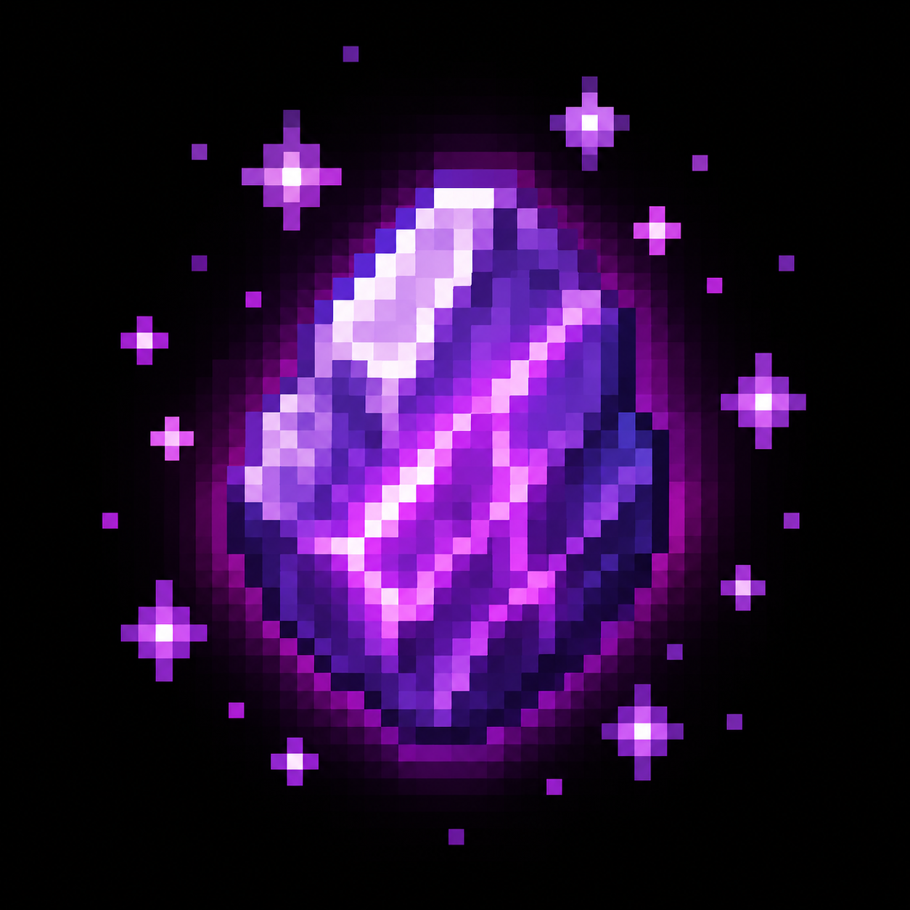
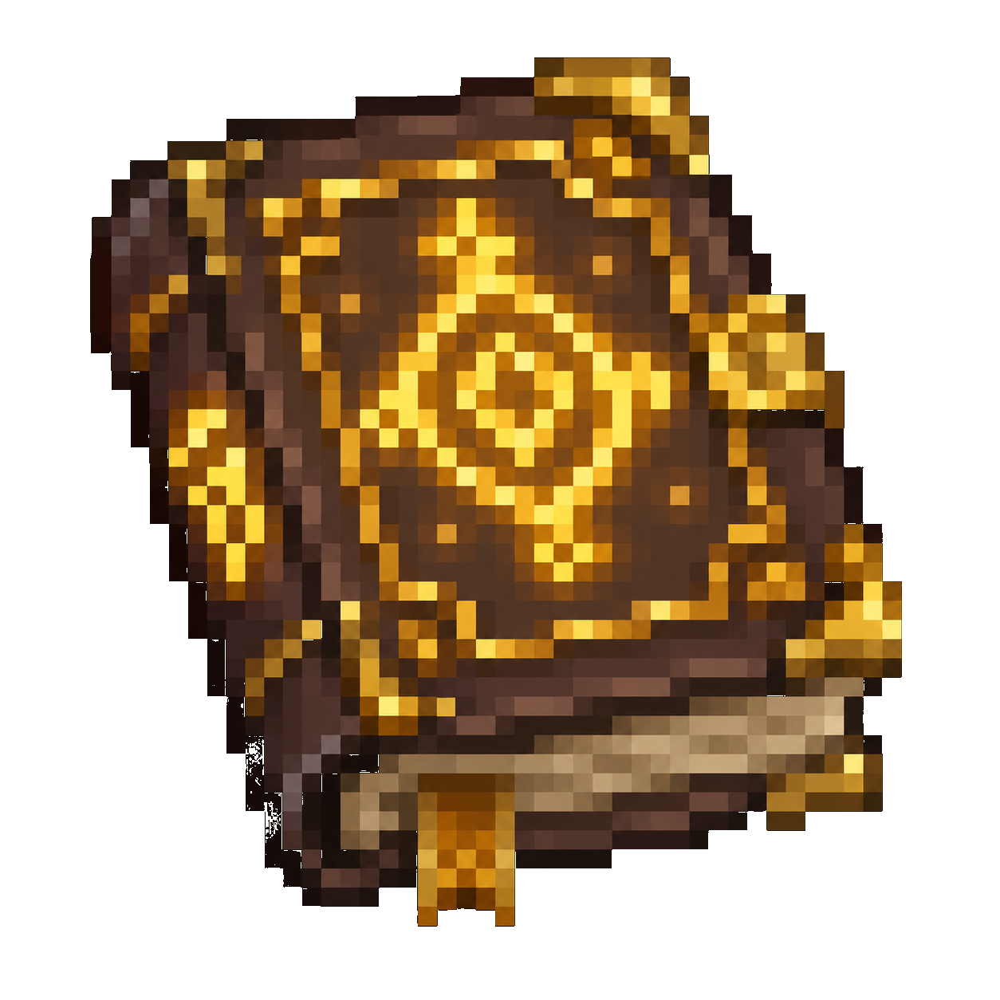
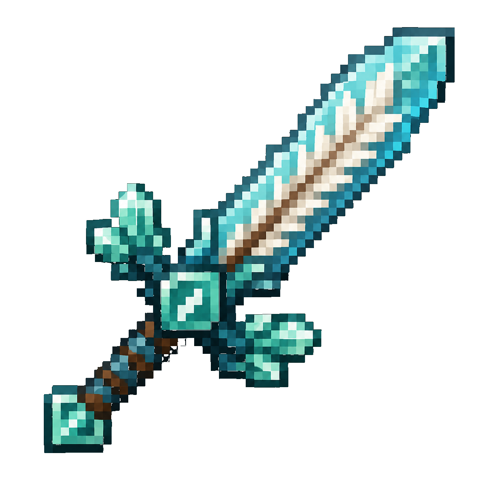

# 🐸 Frog & Slime Gamemode 🫧

**A unique Minecraft Fabric mod where frog and slime helpers beat the game for you!**

[Features](#features) • [Installation](#installation) • [How to Play](#how-to-play) • [Gallery](#gallery) • [Commands](#commands)

---

## What is this?

A custom gamemode where you tame frog and slime helpers that fight mobs and evolve as they kill. Inspired by content creators like Craftee, xxNestorio, DonnieBobes, Skeppy and more, but with an unexpected twist ending like in Groxs videos.

## Features

### 🎮 Core Gameplay
- **Custom Gamemode System**: Activate with `/frogslime start` or in the game menu
- **Helper Mobs**: Tame frog and slime helpers that fight for you
- **Evolution System**: Helpers evolve through 5 stages by defeating mobs
  - Basic → Advanced → Elite → Master → *FINAL FORM*
- **Automatic Collection**: Helpers collect drops from killed mobs

### ✨ Visual Effects
- **Custom Particles**: Helpers spawn particles when evolving, being pet, and during idle
- **Dynamic Name Tags**: Helpers display their evolution stage with color-coded names
- **Animated Entities**: Smooth animations and visual effects
- **Custom Titles**: Dramatic on-screen titles during key moments

### 🎯 Challenges & Progression
- **Task & Challenge System**: Complete 10 insane challenges with rewards
- **Custom GUI**: Open tasks menu with Task Book or `/frogslime tasks`
- **Achievement System**: Unlock 7 custom advancements
- **Player Transformations**: Eat frog/slime food to gain their abilities

### 👹 Boss Fight
- **Giant Slime Boss**: The Ender Dragon has been replaced... with a GIANT SLIME?!
- **Unexpected Ending**: Defeat the boss to trigger the final evolution... but something goes wrong

### 🎁 Custom Items
- **Evolution Stones**: Instantly evolve your helpers
- **Special Foods**: Feed your helpers to strengthen them
- **YouTuber Swords**: Dream, Technoblade, Grian, and Mumbo Jumbo themed weapons
- **Funny Armor**: Mustard Helmet, Orphan Shield, Prankster Chestplate
- **Task Book**: View and track your challenges
- **Final Evolution Crystal**: Unlock the ultimate slime form

## 🎮 Crafting Recipes (Minecraft GUI)

### Evolution Stone

  

    

    

      💎
      

        
Diamond

        
Crafting Material

        
Durability: 1561

      

    

    

    

      💎
    

    

      🫧
    

    

      💎
    

    

    

      💎
    

    

  

  

    ➡️
  

  

    

      ✨
    

    
Evolution Stone

  

### Dream Sword

  

    

    

      🟨
    

    

    

      🟨
    

    

      ⚔️
    

    

      🟨
    

    

    

      🟨
    

    

  

  

    ➡️
  

  

    

      ⚔️
    

    
Dream Sword

  

### Slime Food

  

    

      🫧
    

    

      🫧
    

    

      🫧
    

    

      🫧
    

    

      🐰
    

    

      🫧
    

    

      🫧
    

    

      🫧
    

    

      🫧
    

  

  

    ➡️
  

  

    

      🍖
    

    
Slime Food x8

  

## 🏆 Achievements

  

    
🐸

    
First Helper

    
Tame your first frog or slime

  

  

    
⭐

    
Evolution Beginner

    
Evolve a helper to stage 1

  

  

    
⭐⭐

    
Evolution Expert

    
Evolve a helper to stage 2

  

  

    
⭐⭐⭐

    
Evolution Master

    
Evolve a helper to stage 3

  

  

    
👑

    
Final Form

    
Unlock the final slime evolution

  

  

    
👹

    
Boss Slayer

    
Defeat the Giant Slime Boss

  

  

    
📋

    
Task Master

    
Complete all 10 challenges

  

## 📦 Item Collection with Stats

  

    
✨

    
Evolution Stone

    
✨ Epic

    
Instant Evolution

  

  

    
⚔️

    
Dream Sword

    
🌟 Legendary

    
Attack: 12 | Speed: +0.5

  

  

    
🗡️

    
Techno Sword

    
🌟 Legendary

    
Attack: 14 | Knockback: +2

  

  

    
🍖

    
Slime Food

    
🟢 Common

    
Health: +5 | Damage: +1

  

  

    
🪰

    
Frog Food

    
🟢 Common

    
Health: +3 | Jump: +1

  

  

    
📖

    
Task Book

    
🔵 Rare

    
Task Tracking

  

## ⭐ Evolution Skill Tree

  

    
⚔️

    

      
Basic Attack

      
Your helper can attack nearby mobs

      
✓ Unlocked

    

  

  

    
📦

    

      
Mob Collection

      
Helper automatically collects drops

      
✓ Unlocked

    

  

  

    
⭐

    

      
Evolution Stage 1

      
Unlock first evolution stage

      
✓ Unlocked (Kill 10 mobs)

    

  

  

    
⭐⭐

    

      
Evolution Stage 2

      
Unlock second evolution stage

      
🔒 Locked (Kill 25 mobs)

    

  

  

    
👑

    

      
Final Evolution

      
Unlock ultimate slime form

      
🔒 Locked (Defeat Giant Slime Boss)

    

  

### Quick Recipe Reference
<table>
  <tr>
    <td align="center"> <b>Frog Helper</b></td>
    <td align="center"> <b>Slime Helper</b></td>
    <td align="center"> <b>Giant Slime Boss</b></td>
  </tr>
  <tr>
    <td align="center"> <b>Final Form Slime</b></td>
    <td align="center"> <b>Frog King</b></td>
    <td align="center"></td>
  </tr>
</table>

### Items
<table>
  <tr>
    <td align="center"> <b>Evolution Stone</b></td>
    <td align="center"> <b>Final Evolution Crystal</b></td>
    <td align="center"> <b>Task Book</b></td>
  </tr>
  <tr>
    <td align="center"> <b>Dream Sword</b></td>
    <td align="center"> <b>Technoblade Sword</b></td>
    <td align="center"> <b>Grian Sword</b></td>
  </tr>
</table>

## Installation

### Requirements
- Minecraft 1.20.1
- Fabric Loader
- Fabric API

### Steps
1. Install [Fabric Loader](https://fabricmc.net/)
2. Download the latest [Fabric API](https://www.curseforge.com/minecraft/mc-mods/fabric-api)
3. Download the latest release of Frog & Slime Gamemode
4. Place both `.jar` files in your `mods` folder
5. Launch the game!

## How to Play

1. **Start the gamemode**: `/frogslime start` or open the game menu
2. **Spawn helpers** using spawn eggs (creative mode or craft them)
3. **Right-click** to tame frogs and slimes in the wild
4. **Let them fight** mobs and evolve automatically
5. **Use Evolution Stones** to speed up evolution
6. **Open Task Book** with right-click to see challenges
7. **Complete tasks** to unlock rewards
8. **Journey to The End** to face the GIANT SLIME BOSS
9. **Beat the boss** for the shocking finale... or will you?

### Evolution System

**Frog Helper Evolution:**
- Stage 0 → Stage 1: Kill 10 mobs
- Stage 1 → Stage 2: Kill 25 mobs
- Stage 2 → Stage 3: Kill 50 mobs

**Slime Helper Evolution:**
- Stage 0 → Stage 1: Kill 15 mobs
- Stage 1 → Stage 2: Kill 35 mobs
- Stage 2 → Stage 3: Kill 60 mobs

Each evolution increases:
- Health (+10 for frogs, +15 for slimes per stage)
- Attack Damage (+2 for frogs, +3 for slimes per stage)
- New visual effects at higher stages

### Final Evolution (Slime Only)
After defeating the Giant Slime Boss, use the **Final Evolution Crystal** on your slime helper to unlock its ultimate form:
- 200 Health
- 30 Attack Damage
- 100% Knockback Resistance

## Commands

| Command | Description |
|---------|-------------|
| `/frogslime start` | Begin the gamemode |
| `/frogslime stop` | Stop the gamemode |
| `/frogslime info` | Show help information |
| `/frogslime tasks` | Open tasks & challenges menu |

## Tasks & Challenges

| Challenge | Description |
|-----------|-------------|
| 🟤 Eat 64 Dirt Blocks | "Why? Because we can!" |
| 🐸 Jump 100 Times Near Frogs | "They love it when you dance!" |
| 🫧 Have 5 Slime Helpers | "It's a slime party!" |
| ⭐ Evolve to Master | "Peak performance achieved!" |
| 💀 Helpers Eat 100 Mobs | "Nom nom nom..." |
| 💀 Die 100 Times | "Pain is temporary, glory is forever" |
| 🍎 Eat Golden Apple Transformed | "Maximum power!" |
| 💎 Craft 100 Evolution Stones | "Stonks!" |
| 🚪 Reach The End | "The final challenge awaits..." |
| 👹 Defeat Giant Slime Boss | "Wait... where's the dragon?" |

## The Twist

When you defeat the Giant Slime Boss (yeah, we replaced the Ender Dragon with a GIANT SLIME) with your slime helper nearby, it will absorb the boss's power and unlock its FINAL FORM. Dramatic particles explode everywhere, custom titles appear on screen, and your slime becomes an unstoppable force of nature.

But be warned... your slime may become too powerful. What have you created?

**TO BE CONTINUED...**

## Why This Exists

This mod feels like it was made by a modded YouTuber with too much free time (and it kind of was). Inspired by the chaotic energy of Craftee, xxNestorio, DonnieBobes, Skeppy, and the unexpected plot twists of Groxs videos.

## Contributing

Contributions are welcome! Feel free to submit issues, feature requests, or pull requests.

## License

This project is licensed under the MIT License - see the [LICENSE](LICENSE) file for details.

---

Created by **WayaCreate** (Waya Steurbaut)

[YouTube](https://youtube.com/@wayacreate) • [GitHub](https://github.com/wayacreate)

